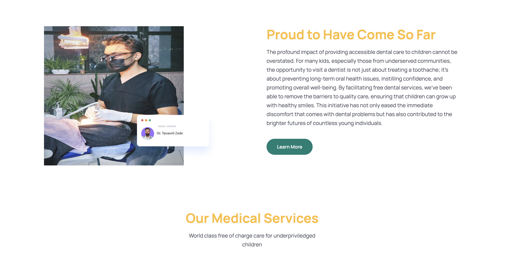

<a name="readme-top"></a>


<!-- PROJECT LOGO -->
<br />
<div align="center">
  

  <h3 align="center">Dentist Appointment Project</h3>
</div>


<!-- TABLE OF CONTENTS -->
<details>
  <summary>Table of Contents</summary>
  <ol>
    <li>
      <a href="#about-the-project">About The Project</a>
      <ul>
        <li><a href="#built-with">Built With</a></li>
      </ul>
    </li>
    <li>
      <a href="#getting-started">Getting Started</a>
      <ul>
        <li><a href="#prerequisites">Prerequisites</a></li>
      </ul>
    </li>
    <li>
      <a href="#getting-started-with-docker">Getting Started With Docker</a>
    </li>
  </ol>
</details>


<!-- ABOUT THE PROJECT -->
## About The Project

A Dentist Appointment Project has been writen with Django and React just for learning purposes

<p align="right">(<a href="#readme-top">back to top</a>)</p>


### Built With

* [![React][React.js]][React-url]
* [![Django][Django]][Django-url]

<p align="right">(<a href="#readme-top">back to top</a>)</p>


<!-- GETTING STARTED -->
## Getting Started

This is an example of how you may give instructions on setting up your project locally.
To get a local copy up and running follow these simple example steps.

### Prerequisites

This is an example of how to list things you need to use the software and how to install them.


## Frontend Prerequisites

* cd
  ```sh
  cd frontend
  ```

* yarn
  ```sh
  yarn install
  ```

* run
  ```sh
  yarn dev
  ```

## Backend Prerequisites

* cd
  ```sh
  cd backend
  ```

* venv
  ```sh
  python3 -m venv venv
  ```

* activate
  ```sh
  venv/Scripts/activate
  ```

* pip
  ```sh
  pip3 install -r requirements.txt

  ```

* run
  ```sh
  python3 manage.py runserver

  ```


## Getting Started With Docker

you can start both backend and frontend toghether with docker

*Install Docker Desktop

then 

* run
  ```sh
  docker compose up

  ```

*frontend server: ```localhost:3000```
*backend server: ```localhost:8000```


<!-- MARKDOWN LINKS & IMAGES -->
[React.js]: https://img.shields.io/badge/React-20232A?style=for-the-badge&logo=react&logoColor=61DAFB
[React-url]: https://reactjs.org/
[Django]: https://img.shields.io/badge/Django-092E20?style=for-the-badge&logo=django&logoColor=green
[Django-url]: https://www.djangoproject.com/
